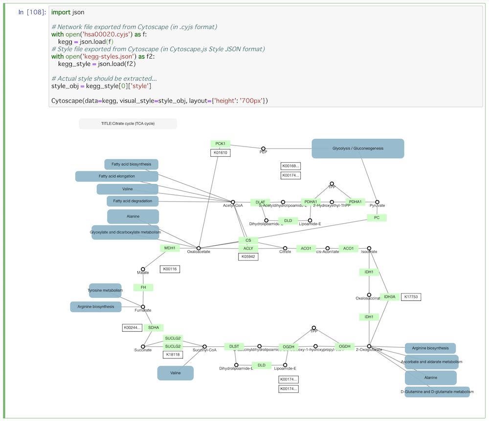
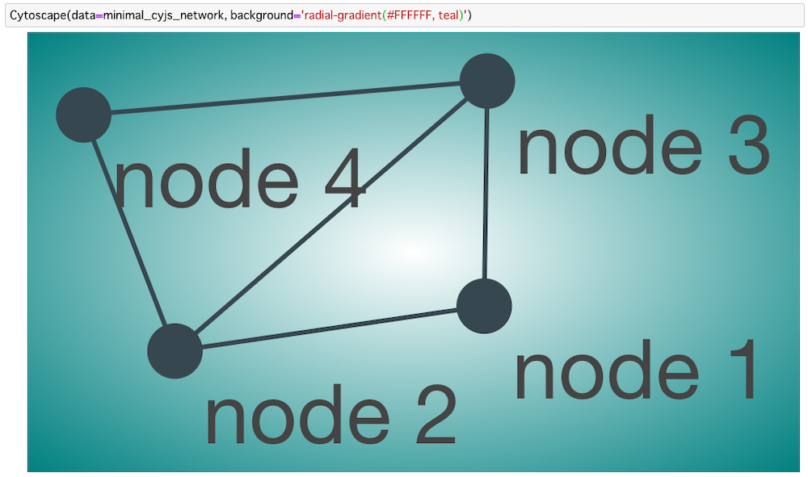

# CyJupyter (cytoscape-jupyter-widget)

### An interactive network visualizer for Jupyter Notebook

## Introduction

_**Cytoscape Jupyter Widget**_, or _**CyJupyter**_, is a simple interactive network visualizer for Jupyter Notebook.  You can easily visualize network data in JSON / Python Dict using built-in Cytoscape.js visualizer.

### For _JupyterLab_ users

There is another network visualizer for JupyterLab:

This package is still under development, but we will add more features to it and release the final version once JupyterLab extention API is finalized.

## Features

* Interactive network visualization using Cytoscape.js
* Full support for Cytoscape.js compatible _Styles_
  * Mapping data points to color, size, shape, etc.

* Support for complex network structures, including compound nodes

* Support for built-in automatic layouts (_circle, grid, cose_, etc.)
* Support for Cytoscape.js and CX JSON formats
  * You can easily converted network data from/to these formats using popular network analysis libraries, such as [NetworkX](https://networkx.github.io/) 
* Adjustable cell size
* Custom background

## Installation

### From PyPI

To install use pip:

    $ pip install cyjupyter
    $ jupyter nbextension enable --py --sys-prefix cyjupyter

### Install from source

For a development installation (requires npm),

    $ git clone https://github.com/idekerlab/cytoscape-jupyter-widget.git
    $ cd cytoscape-jupyter-widget
    $ pip install -e .
    $ jupyter nbextension install --py --symlink --sys-prefix cyjupyter
    $ jupyter nbextension enable --py --sys-prefix cyjupyter

## Quick Start

Please try [this notebook](examples/WidgetDemo1.ipynb) to learn how to use this widget.

## License

[MIT](https://opensource.org/licenses/MIT)

----
&copy; 2018 Keiichiro ONO ([UCSD Trey Ideker Lab](https://medschool.ucsd.edu/som/medicine/research/labs/ideker/Pages/default.aspx))
