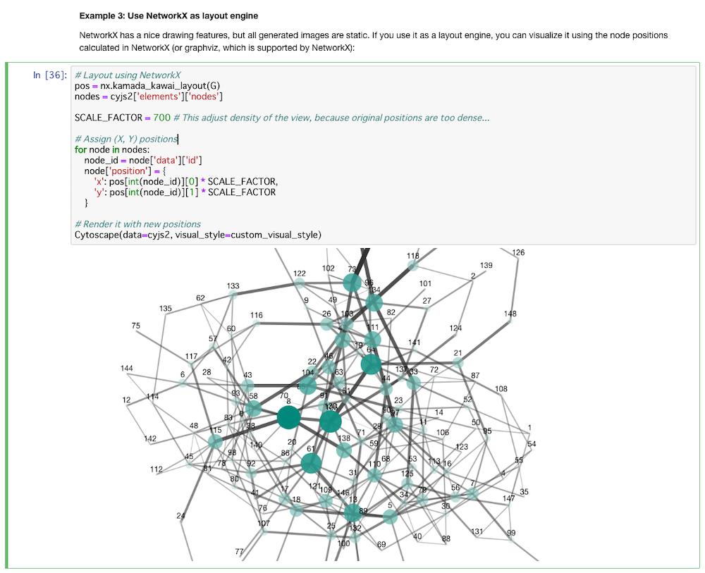

:warning: **This widget is deprecated.  We recommend you try [ipycytoscape](https://github.com/cytoscape/ipycytoscape).**

# CyJupyter (cytoscape-jupyter-widget)

### An interactive network visualizer for Jupyter Notebook

## Introduction


_**Cytoscape Jupyter Widget**_, or _**CyJupyter**_, is a simple interactive network visualizer for Jupyter Notebook.  You can easily visualize network data in JSON / Python Dict with built-in [Cytoscape.js](http://js.cytoscape.org/) visualizer.


### About Cytoscape


[Cytoscape](https://cytoscape.org/) is a [de-facto standard](https://scholar.google.com/scholar?hl=en&as_sdt=0%2C5&q=cytoscape&btnG=) software for biological network analysis and visualization.  It has a [rich ecosystem](http://apps.cytoscape.org/) for network analysis and visualization, and this Jupyter Widget is part of it.  It was developed for biologists, but it core functions are domain-independent and you can use it for all types of network data.

In addition, you can use it from Jupyter Notebook via [CyRest](https://github.com/cytoscape/cyREST/wiki) API.  Since you are interested in Jupyter Notebook environment, combination of Jupyter, CyJupyter, and Cytoscape Desctop with CyREST will be a very powerful workbench for your network analysis workflows.

If you want to interactively edit (large) networks, create PDF/SVG, try the Cytoscape Desktop.  It can read/write CX / Cytoscape.js JSON files and many standard network file formats.  Please visit [here](http://manual.cytoscape.org/en/stable/) for more information.


## Status

* 10/10/2018 - First public version released ([0.2.0](https://pypi.org/project/cyjupyter/0.2.0/))


## Quick Start

```bash
> pip install cyjupyter
> jupyter nbextension enable --py --sys-prefix cyjupyter
> jupyter notebook
```


### For _JupyterLab_ users

There is another network visualizer for JupyterLab:

* https://github.com/idekerlab/cy-jupyterlab

This package is still under development, but we will add more features to it and release the final version once JupyterLab extention API is finalized.


## Features
_CyJupyter_ is a simple data visualization widget, but yet very powerful tool once you understand its engine, Cytoscape.js.

* Interactive network visualization using Cytoscape.js
* Full support for Cytoscape.js compatible _Styles_
  * Mapping data points to color, size, shape, etc.


(Fig. 1: Betweenness cetrarity is mapped to node size, edge width, and node opacity)


* Support for complex network structures, including compound nodes


(Fig. 2: Network with hierachical struture, visualized as _Compound Nodes_)

* Support for built-in automatic layouts (_circle, grid, cose_, etc.)
* Support for Cytoscape.js and CX JSON formats
  * You can easily converted network data from/to these formats using popular network analysis libraries, such as [NetworkX](https://networkx.github.io/) 
* Adjustable cell size
* Custom background


(Fig. 3: Network visualization with custom background using CSS gradient)

* Can be used with popular network analysis tools, such as *NetworkX*



(Fig. 4: Network generated with NetworkX, visualized with CyJupyer)

## Installation

### From PyPI

To install this widget, use _pip_:

```bash
# Install the widget from PyPI repository
> pip install cyjupyter

# Enable it
> jupyter nbextension enable --py --sys-prefix cyjupyter
```

### Install from source

For a development installation (requires npm),

```bash
$ git clone https://github.com/idekerlab/cytoscape-jupyter-widget.git
$ cd cytoscape-jupyter-widget
$ pip install -e .
$ jupyter nbextension install --py --symlink --sys-prefix cyjupyter
$ jupyter nbextension enable --py --sys-prefix cyjupyter
```

## How to use the widget

Once you install this widget, you can use it by importing it to your notebook:

```python
from cyjupyter import Cytoscape
```

**_Cytoscape_** is the only Class in this Widget.  Basic usage is:

```python
Cytoscape(data=network_data, format=cx)
```

where _data_ is the actual network data in Python Dictionary or List (for CX) and _format_ is the network data format name.

### Supported Data Format

Currently, this Widget supports two network formats:

* cyjs - [Cytoscape.js JSON](http://js.cytoscape.org/#notation/elements-json)
* cx - Cytoscape network eXchange format ([CX](http://www.home.ndexbio.org/data-model/))

If you have data in JSON file, you can use Python's standard [json](https://docs.python.org/3.7/library/json.html#module-json) library to convert it into Python Dict/List.

#### Cytoscape.js JSON

The data should be in the following format:

```json
{
  "elements": {
    "nodes":[],
    "edges": []
  }
}
```

for more information about this data model, please visit Cytoscape.js web site.

#### CX JSON Array

This is always a JSON Array and is fairly complex data format, but you can use Python library to 

* [NDEx2 Client](https://github.com/ndexbio/ndex2-client)

Also, for network biologists, [NDEx](http://www.ndexbio.org/) is a great resource. All data sets are availabe in CX format.

Internally, it uses Cytoscape.js as the rendering engine, and if you provide your data in Cytoscape.js format, it is the most efficient way yo visualize your data.  If you provide your data as CX, the Widget automatically convert the data into Cytoscape.js compatible data structure and then visualizes it.

### Examples
The best way to learn this widget is actually visualize some network data.  Please try [this notebook](examples/WidgetDemo1.ipynb) to learn how to use this widget.


## API Reference
(TBD)

* data
* format
* style
* background
* layout_name
* layout


## License

[MIT](https://opensource.org/licenses/MIT)

## Questions / Bugs / Feature Requests?

Please use [GitHub Issue Tracker](https://github.com/idekerlab/cytoscape-jupyter-widget/issues).


----
&copy; 2018 Keiichiro ONO 

[University of California, San Diego: Trey Ideker Lab](https://medschool.ucsd.edu/som/medicine/research/labs/ideker/Pages/default.aspx) / [The Cytoscape Consortium](http://169.228.38.215/) / [National Resource for Network Biology](http://nrnb.org/)
